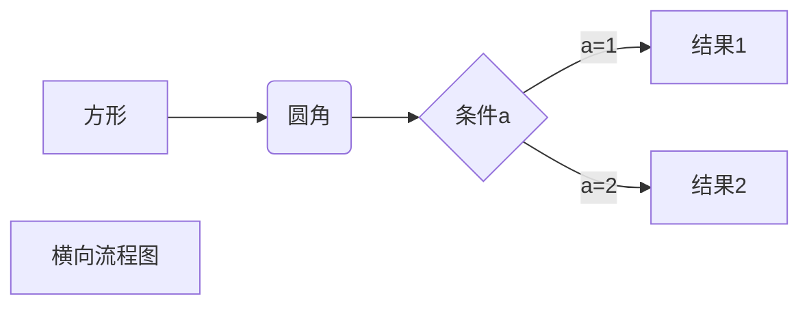

#图库h5静态资源
##图库h5静态资源
###图库h5静态资源
*斜体文本*  
**粗体文本**  
***粗斜体文本***  
***
~~图库h5静态资源~~  
+图库h5静态资源  
    -图库h5静态资源  
+图库h5静态资源  
+图库h5静态资源  
> 最外层
> > 第一层嵌套
> > > 第二层嵌套  
```
    data: {
     step: 1,
     counterId: '',
     openid: '',
     count: null,
     queryResult: '',
   },  
```   
[图库h5](http://tu0.heiguang.com/m)  
|  表头   | 表头  |  
|  ----  | :----:  |  
| 单元格  | 单元格 |  
| 单元格  | 单元格 |  

